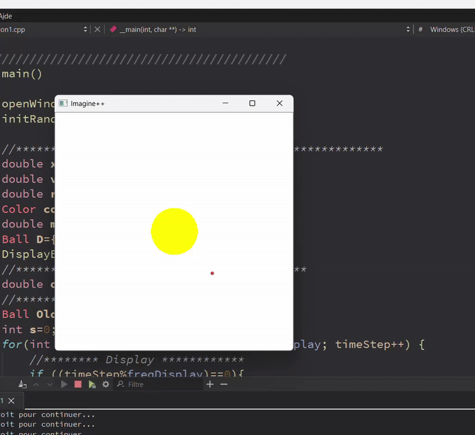
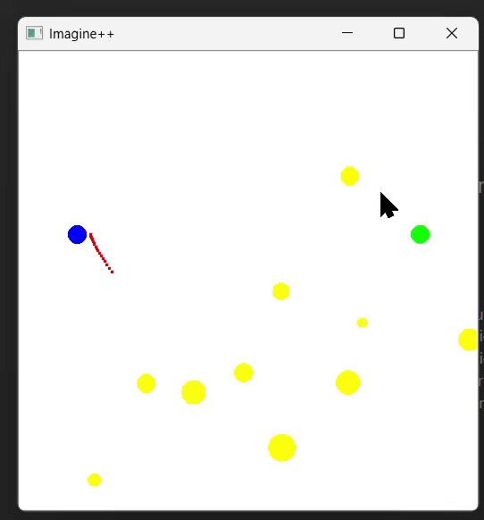

**Author:** Yassine KOUAS  

## Description

This project is a simple 2D simulation of a planet orbiting a fixed sun using the [Imagine++](https://imagine.enpc.fr/) graphics library.  
The simulation implements:  
- Simplified Newtonian gravity  
- Collision detection and handling  
- Dynamic graphical display of moving objects  

## Features

- A fixed sun at the center of the window  
- A planet orbiting the sun with an initial velocity  
- Gravity calculation applied from the sun to the planet  
- Position and velocity updated at each time step (`dt`)  
- Smooth animation using erase/redraw to prevent flickering  

## Project Structure

- `Tp4_Initial.cpp` : main file containing the simulation code  
- `Imagine/Graphics.h` : Imagine++ library used for graphical rendering  

### Main Structures

- `struct Ball` : represents a planet or the sun with attributes:
  - `x, y` : position
  - `vx, vy` : velocity
  - `r` : radius
  - `color` : display color
  - `mass` : mass

## Functions

- `Modify_speed(Ball &D)` : updates the velocity of a ball according to gravitational attraction from the sun  
- `Deplacer_Ball(Ball &D)` : updates the position of a ball according to its velocity  
- `shock(...)` and `shockSimple(...)` : handle elastic collisions between balls  
- `collision(...)` : detects if two balls are colliding  
- `DisplayBall(Ball D)` and `EraseBall(Ball D)` : draw and erase balls on the screen
  # Examples Of Implementation
  **1. Initial Planet Orbit**  
  

**2.Collisions**  
  

**3.Missiles**  
 

## How to Run

1. Install the Imagine++ library on your system  
2. Compile the project using a C++ compiler with Imagine++ linked:
   ```bash
   g++ Tp4_Initial.cpp -o Tp4_Initial -lImagine
